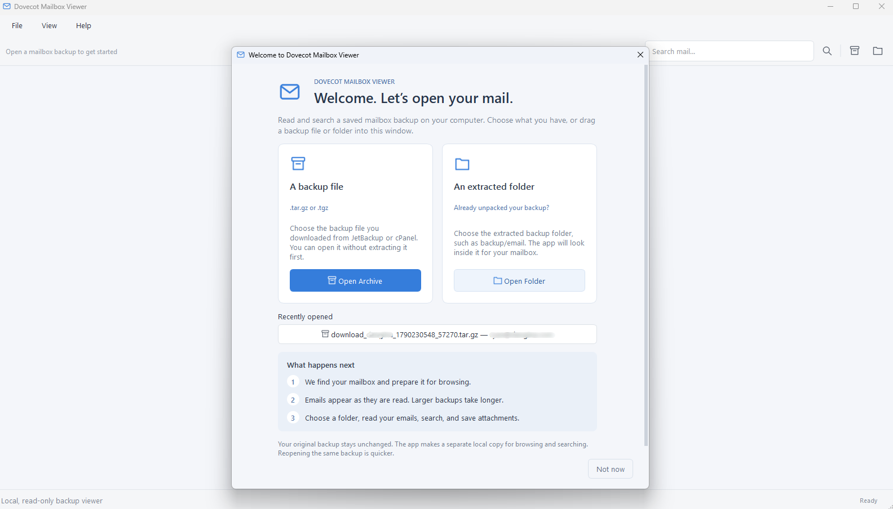
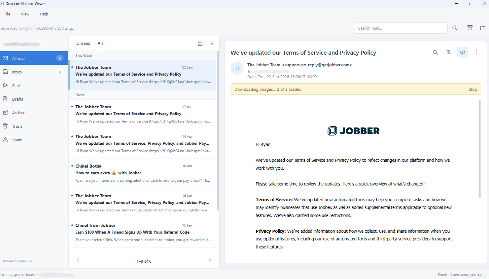

# Dovecot Mailbox Viewer

A local, read-only Windows desktop viewer for JetBackup/cPanel **mdbox** mail backups. Open a `.tar.gz` archive or the extracted `backup/email` directory. Mailbox content stays on your computer; the application makes a separate local cache for searching and previews.

## Download for Windows

**[Download the Windows app (.exe)](https://github.com/DesignStack/Dovecot-Mailbox-Viewer/releases/latest/download/Dovecot-Mailbox-Viewer-Windows.exe)**

For Windows 10/11, 64-bit. Save the file and double-click it. There is no installer,
no ZIP to extract and no Python installation needed. All required application
files are bundled inside the EXE; there is no separate `_internal` folder to copy.
It may take a few seconds to open while it automatically unpacks support files
into a temporary folder, which is normally removed when the app closes.

Choose **Open Archive** or **Open Folder** in the welcome guide to get started.
You can also drag a `.tar.gz`, `.tgz` or extracted folder onto the app or welcome
window. **File → Recent backups** and the welcome screen let you reopen recent
backups. The history stays on your computer; **Clear recent backups** removes
only the history, not the original files or search caches.

To update, close the app and replace your old EXE with the new download. Your
original backup and reusable search cache are kept separately.
**Help → Check for updates** checks GitHub only when you request it and opens
the release page if a newer version is available. It does not send your emails,
account names or backup paths, and does not download or install updates automatically.

[Release notes and older downloads](https://github.com/DesignStack/Dovecot-Mailbox-Viewer/releases)
· [Changelog](CHANGELOG.md)

Check the installed version in **Help → About** or the EXE's Windows **Properties
→ Details**. Each release also includes `SHA256SUMS.txt` for checking its download.
The **Source code** ZIP links on release pages are for developers.

## Screenshots

**Welcome guide** — open a backup archive, choose an extracted folder or reopen a recent backup.



**Mailbox view** — browse folders, filter unread mail and read HTML emails.



## Export, print and save as PDF

- **One email:** use the email's three-dot menu or File → Export email as .eml.
- **Several emails:** hold Ctrl or Shift to select messages, then choose
  **File → Export selected emails**. Ctrl+A selects the emails currently listed.
- **A complete folder:** select it on the left, then choose **File → Export entire
  folder**. With All mail selected, the action becomes **Export all mail**.
  These exports ignore search filters and include every page.
  Wait for indexing to finish before exporting a complete folder.

Bulk exports create a new `Mail-export-…` folder at your chosen destination,
with a separate subfolder for each mailbox folder and the original `.eml` bytes.
Filenames are made safe for Windows. Existing exports are never overwritten.
The progress window offers Cancel; completed emails are kept if you cancel.

Use **Save email as PDF** or **Print email** from File or the email's three-dot
menu. **Ctrl+P** opens the print dialogue. The output includes the subject,
sender, recipients, date, attachment names and email body. Attachments themselves
are saved separately; they are not embedded in the PDF. Printing does not download
remote images: use Download images first if you want them included.

**File → Exit** or **Ctrl+Q** closes the app, safely stopping an ongoing import.
Finish or cancel a running export first.

## Browse, sort and read

- The underlined **Unread / All** tabs filter the current folder and search.
  All is selected when opening a backup. Unread includes only messages marked unread
  by the backup's supported Dovecot indexes; unknown status is not treated as unread.
  Opening an email never changes its stored read status.
- Click the **sort icon** at the top right of the message list for **Newest first**,
  **Oldest first**, **Sender A–Z/Z–A** or **Subject A–Z/Z–A**. The menu shows the active
  order. Date sorting uses the actual timestamp, including its time zone.
- The adjacent **list layout icon** offers **Preview** (sender, subject and body
  snippet) or **Compact** (sender, subject and date, without the body snippet).
  Both layouts retain attachment indicators, unread styling and multi-selection.
- When sorted by date, emails appear under populated headings such as **Today**,
  **Yesterday**, **This Week**, **Last Week**, **Two Weeks Ago**, **Three Weeks Ago**,
  **Earlier This Month**, **Last Month** and **Older**. Dates use your computer's
  local time and first weekday. Day/week groups take precedence over month groups,
  so a message appears only once. Future and unknown dates have separate headings;
  unknown dates sort last. Sender/subject sorting stays alphabetical without date
  sections. Relative headings refresh after midnight while the app is open.
- Page controls below the list let you browse every email. There is no 5,000-message
  cutoff. **View → Settings** offers 100, 200 or 500 messages per page.
- Enable **View → Conversation view** to group replies. A selector above the email
  body opens individual messages in chronological order, including related messages
  in other folders. Grouping uses Message-ID, References and In-Reply-To headers;
  matching subjects alone do not combine unrelated emails. The list respects your
  current folder/search; the conversation selector shows the whole related thread.
- Search matches are highlighted in the message list and email body. **Ctrl+F** opens
  mailbox search options; **Ctrl+G** opens Find within the displayed email.
  Use **F3 / Shift+F3** for the next/previous match.
- At the top right of the email, the **magnifying-glass zoom icon** offers presets
  and a custom **60–200% text zoom**, with 100% as the default.
- The **code icon** beside it toggles **HTML / Plain text**. HTML is enabled by
  default; a highlighted icon means HTML is on. Your choice is remembered.
  Switching format never grants permission to download remote images.
- The email's **three-dot menu → View original headers** shows the original header
  order, repeated fields and folded lines, with a Copy all button.
- **Save all attachments** creates a new folder containing every attachment from
  the displayed email. Duplicate filenames are kept as separate numbered files.
  Individual attachment cards remain directly below the message details.
- When conversation view is enabled, **Export selected conversations** exports all
  related messages, including those outside the current search/folder. Single-email
  export, PDF and print always use the message currently displayed in the reader.

**View → Settings** stores sorting, Compact/Preview layout, conversation mode, page size, highlighting,
preferred email format, reading zoom, layout restoration and recent-backup history.
Window size and panel widths are restored when enabled. Remote images always need
per-message consent; there is no automatic image-download setting.

**File → Cache manager** lists saved indexes, source locations, sizes and indexing
status. Select one or more to remove them. Removing the current index closes its
mailbox; original backups, settings and diagnostic logs are kept. Cache management
is available after an import/export has finished or been cancelled.

## Run from source

Install Python 3.11+ on Windows, then in PowerShell:

```powershell
py -m venv .venv
.venv\Scripts\Activate.ps1
pip install -r requirements.txt
python -m viewer.app
```

On startup, a welcome guide explains the two ways to open your mailbox:

- **Open Archive**: choose the `.tar.gz` or `.tgz` backup file. There is no need to extract it first.
- **Open Folder**: choose the extracted backup folder, such as `backup/email`.

The guide explains how emails appear as the backup is prepared and that your original
backup is never changed. Cancelling a file picker keeps the guide open. **Not now**
closes the guide and leaves the same choices on the empty screen. Reopen it with
**Help → Getting started**. It also returns when the current cache is cleared or an
import fails before any mail is loaded.

Choose **Open archive** or **Open folder**. A background task scans the mailbox and builds a local SQLite search index. Select folders on the left, messages in the middle, and read the message on the right. Search terms match subject, sender, recipients and plain-text message content. Use **All mail** to search across folders. The search options button adds sender, subject, date and attachment filters. Attachments also appear as cards below the message date, showing a file-type icon, filename and size. Click a card to save that file. Use the **three-dot menu** at the top right of an email to save attachments, export the original `.eml`, or download images. The top toolbar has Search options followed by Open archive and Open folder, all with matching outline icons. The app opens one mailbox at a time; a multi-account backup asks which mailbox to open. **File → Cache manager** removes selected derived copies and search indexes from your computer.

HTML emails are displayed in the preview. Remote images are blocked by default;
the message banner offers **Download images** for that message only. Each request has a
20-second total deadline, including redirects and connection setup. **Stop** cancels
outstanding requests; successfully loaded images stay visible. If some fail, the banner
shows how many loaded and offers **Try again**. Inline
images stored inside the email are displayed locally. External links open only
after confirmation. Qt's HTML renderer supports common email layouts, but
complex CSS may look different from a browser.

The progress bar shows how much of the selected mailbox's `m.*` storage has been
processed, with a running message count. If an import fails, use **File → Open
diagnostic log**. The log lives at
`%LOCALAPPDATA%\DesignStack\DovecotMailboxViewer\viewer.log`; it records paths,
counts and error details, but does not intentionally log email bodies. Check
the log before sharing it, since file paths can contain account names.

## Build the Windows application

On Windows, right-click `build-windows.ps1` and run it in PowerShell, or run
`powershell -ExecutionPolicy Bypass -File .\build-windows.ps1` from the project
folder. This installs build dependencies, runs the tests and builds
`dist/Dovecot-Mailbox-Viewer-Windows.exe` using PyInstaller's one-file mode.
It embeds the app version in Windows file properties, checks the actual EXE
from a clean folder and writes `dist/SHA256SUMS.txt`. No supporting folder is
needed beside this executable.

**Actions → Build Windows app → Run workflow** also builds it on Windows.
New versions on `main` automatically become public GitHub Releases after all
checks pass. The workflow never overwrites an already published version.
See [Publishing a version](docs/releasing.md) for the version and changelog steps.
Development builds are available as Actions artifacts; end users should use the
direct **Download the Windows app** link above.

Older, unversioned builds used a ZIP containing an EXE and `_internal` folder.
That folder is required by those older builds. The new portable EXE includes
those dependencies and can be kept on its own.

## Scope and limitations

- The source archive and extracted mailbox are never changed. Search caches and logs are stored in `%LOCALAPPDATA%/DesignStack/DovecotMailboxViewer`. The portable EXE also unpacks its runtime into a temporary folder; exports are written only where you choose to save them.
- Recognises the dbox `m.*` container used by the supplied backup, including gzip-compressed message records and the `B<mailbox>` metadata. It discovers folders even if empty.
- Validated GUID-bearing, little-endian Dovecot 7.x main index snapshots and 1.0–1.3 transaction logs supply folder placement and read/deleted/expunged flags. Contiguous rotated logs are replayed after the snapshot's recorded position. Unsupported layouts, missing log history and ambiguous GUIDs remain unknown; `B` metadata supplies the fallback folder. Separate mdbox map indexes are not interpreted. This is not an exact live-mailbox reconstruction for every Dovecot version.
- HTML messages render locally with external resources blocked by default. Loading external images is a per-message choice. Failed downloads keep the notice visible with a **Try again** link and diagnostic logging. Attachments are never run automatically.
- Archives are processed one storage file at a time; a large archive requires free disk space for the private search database. Initial indexing may take time. Tar paths are never extracted to arbitrary destinations.
- Verified with the supplied eight-message JetBackup sample and synthetic format/regression tests. Wider real-world Dovecot backup coverage is still needed before treating this as a general-purpose forensic viewer.

## Code layout

- `viewer/mdbox.py` scans tar/folder inputs and yields validated message bytes and mailbox metadata.
- `viewer/catalog.py` builds and queries a private SQLite catalogue and full-text index.
- `viewer/app.py` contains mailbox navigation and the Qt interface.
- `viewer/importing.py` performs cancellable discovery, cache checks and incremental import off the GUI thread.
- `viewer/reading.py` provides conversation navigation, finding/highlighting, zoom, headers and attachment actions.
- `viewer/preferences.py` and `viewer/cache_manager.py` provide local settings and safe cache management.
- `viewer/list_controls.py` provides mail tabs and outline icon menus; `viewer/date_groups.py` assigns local calendar headings.
- `viewer/dovecot_index.py` validates supported main indexes and transaction logs.
- `viewer/operations.py` supplies cooperative cancellation during archive reads.
- `viewer/version.py` is the single source for the app and release version.
- `viewer/exporting.py` streams complete or selected email exports on a worker thread.
- `viewer/printing.py` prepares safe email printouts and PDF exports.
- `viewer/recent.py` keeps local backup history and validates dropped paths.
- `viewer/updates.py` checks GitHub releases only on request.
- `scripts/prepare_release.py` generates Windows version metadata and release notes.
- `scripts/publish_release.py` publishes tested binaries through GitHub Releases.
- `viewer/welcome.py` provides the startup guide and empty-state opening choices.
- `viewer/html_preview.py` handles safe HTML previews and the optional image requests.
- `tests/test_mdbox.py` tests dbox records without using private email fixtures.
- `viewer/icons.py` provides the original single-colour outline icons; `viewer/mail_widgets.py` paints folder and message rows.
- `tests/test_gui.py` checks the background import, GUI thread handoff and export action.
- `tests/test_image_downloads.py` uses a local HTTP server to test downloads, encoded URLs, redirects, repainting, retries and cancellation.

Do not commit client email archives or generated cache folders to GitHub.

### Progressive viewing and cache

Discovery, fingerprint checks and importing run in the background. The status bar
shows the current phase immediately and offers **Cancel opening**. Discovery and
status reading use an activity indicator; the percentage during message reading
measures bytes consumed from the selected mailbox's storage files. Compressed
archives are read in physical order to avoid repeated gzip seeks. Emails become
readable and searchable as batches are committed; search covers the messages
processed so far.

Cancelling keeps already committed messages available for browsing and individual
export, but marks the index incomplete. Reopen the backup to rebuild the complete
index. Whole-folder export stays disabled for incomplete indexes.

Completed indexes are reused if the source identity is unchanged. Recently opened,
unchanged archives can also skip mailbox discovery; folder backups check file paths,
sizes and modification times in the background. Version 0.3.0 rebuilds older caches
once to add normalised dates and conversation links. Subsequent openings reuse the
new index. These checks use file metadata, not a cryptographic hash of the backup.

The local SQLite cache contains email content and search data. **File → Cache
manager** removes saved indexes and causes a rebuild next time the backup is opened.
A filled circle marks mail known to be unread; unknown status is left unmarked.
Deleted and expunged messages still present in storage remain available for recovery.
The original `.eml` bytes are preserved during export.


## About the author

Created by [DesignStack](https://designstack.co.uk), a web design agency in Weymouth, Dorset.

Questions or feedback? [Contact the author](mailto:hello@designstack.co.uk). You can also use **Help → Contact author** or **Help → About** in the app.
